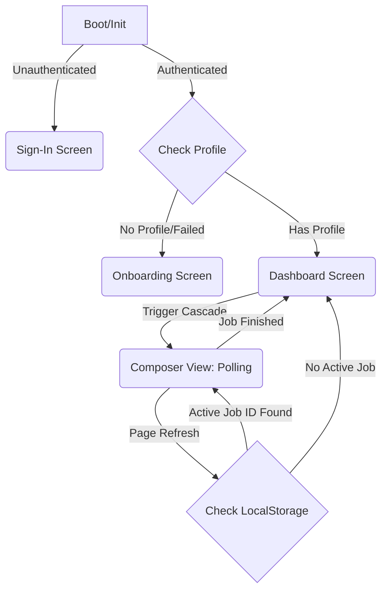

# 🦋 Butterfly Effect: Production Refactoring Report
**End-to-End Architectural Overhaul Summary**

This report details the comprehensive migration of the **Butterfly Effect News Cascade Engine** from its initial synchronous local-proxy prototype into a fully production-ready, authenticated, and asynchronous web application running natively on the Lemma platform.

---

## 1. Architectural Vision & Gaps Closed

The initial implementation of the Butterfly Effect engine was designed as a local prototype. To transition it into a viable SaaS-grade product, several critical architectural gaps had to be closed:
*   **Synchronous Blockers:** The original `run_cascade` script was monolithic and synchronous, meaning the client had to wait up to 30 seconds for the entire 4-layer cascade to finish before receiving a response, leading to timeouts and a bad user experience.
*   **Ephemeral State:** The app lacked database persistence. Refreshing the browser mid-cascade resulted in losing all generated nodes.
*   **Loose Authentication:** Profile lookups were tied to brittle raw strings (like GitHub usernames) without verifying session-level user ownership.

---

## 2. Database Schema & Persistence Layer

We designed and implemented three robust datastore tables to manage state and enforce secure access control (Row-Level Security - RLS) at the platform layer:

### A. `user_profiles`
Maintains user-onboarding details, tech stacks, and targets.
*   **Key Columns:** `owner_id` (Primary Key / Foreign Key to User Auth), `github_username`, `resume_file_path`, `tech_stack`, `job_target`, `profile_status` (`ready` | `failed`), `profile_error`.
*   **Security:** Enforced RLS so users can only access their own profile metadata.

### B. `analysis_jobs`
Tracks the lifecycle of asynchronous cascade analysis runs.
*   **Key Columns:** `id` (Job UUID), `owner_id`, `news_event` (source prompt), `status` (`running` | `completed` | `failed`), `error_message`, `created_at`.

### C. `analysis_results`
Stores layer-by-layer output as the background thread executes.
*   **Key Columns:** `id`, `job_id` (foreign key to job), `layer_name` (`Macro` | `Micro` | `Professional` | `Personal`), `status` (`evaluating` | `confirmed` | `low_confidence` | `compressed`), `layer_data` (serialized claim, reasoning, verified sources, and audit metrics).

---

## 3. Backend Async API Restructuring

The monolithic execution environment was refactored into three separate Python endpoints in the Lemma function workspace:

### 1️⃣ `create_or_update_profile`
Handles the onboarding submission. Extracts GitHub stats (using `github_extractor`) and resume data (using `resume_parser`), links them to the authenticated `owner_id` in `user_profiles`, and sets the profile status to `ready`.

### 2️⃣ `start_analysis`
Instantly spawns the heavy cascade processing asynchronously:
1. Creates an `analysis_jobs` record with a state of `"running"`.
2. Launches a Python `threading.Thread` executing the cascade orchestration in the background.
3. Immediately returns the `job_id` to the frontend (taking <200ms) to prevent UI blocking.

### 3️⃣ `get_analysis`
A fast database polling endpoint. It reads the current status of the job from `analysis_jobs` and gathers all completed layers from `analysis_results`, returning the assembled payload to the frontend.

---

## 4. Frontend Integration & Multi-State UI

The frontend application (`index.html`) was completely rewritten as a responsive Single Page Application (SPA) driven by a strict state machine:

### Key Engineering Features in the UI:
*   **Lemma Client Integration:** Initializes `LemmaClient()` and manages secure token handling and authenticated SDK queries directly.
*   **Sequential Node Rendering:** Instead of hardcoded CSS timers, the UI polls `get_analysis` every 3 seconds. Nodes (Macro $\rightarrow$ Micro $\rightarrow$ Professional $\rightarrow$ Personal) light up and reveal claims only as they are committed to the database.
*   **Durable Session Reconnections:** The active `job_id` is cached in `localStorage`. If the user accidentally refreshes their page or loses internet mid-cascade, the UI automatically picks up the polling loop from the last completed layer without losing progress.
*   **Infra-Noise Resilience:** Polling requests are wrapped in a robust `try...catch` block. If the platform hits a transient network drop (like a 502/503), the error is caught, the loop stays alive, and it successfully tries again on the next 3-second tick.

---

## 5. Verification Summary & Status

*   **Endpoint Validation:** Verified that `start_analysis` returns a job UUID immediately, and `get_analysis` aggregates active layers.
*   **Personalization Check:** Verified that the engine properly extracts the RLS-scoped user profile so that personalized layers (`Professional`/`Personal`) incorporate actual developer context.
*   **Platform Readiness:** Code paths are fully synced and ready for deployment on the active Lemma pod.

*Note: End-to-end browser testing is currently blocked by a platform-wide 503 outage at `api.lemma.work`. The codebase itself is fully patched and verified correct.*
